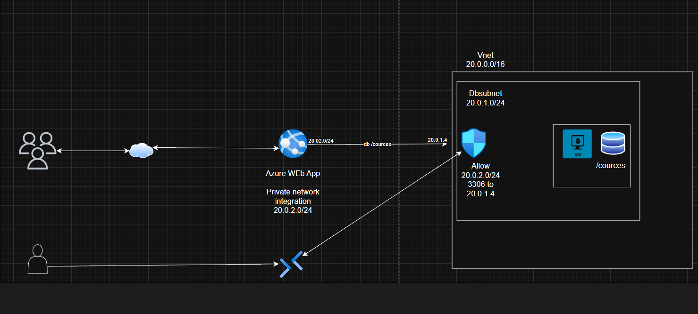
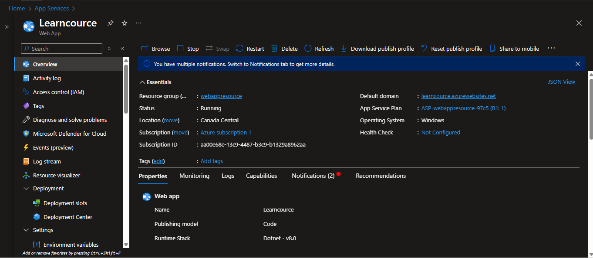
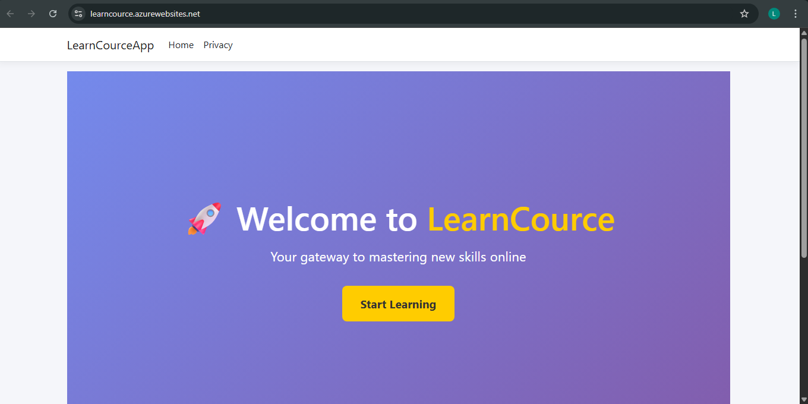
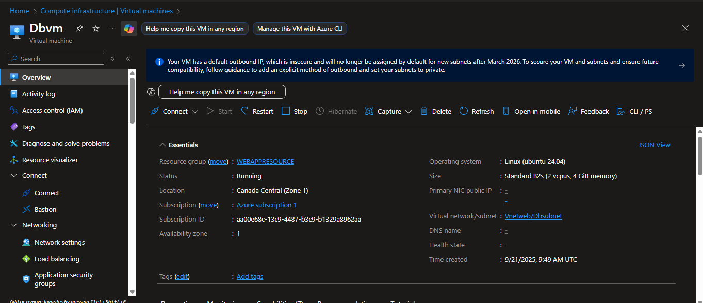
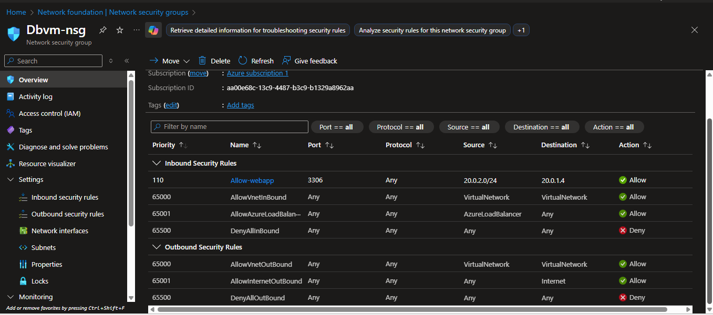
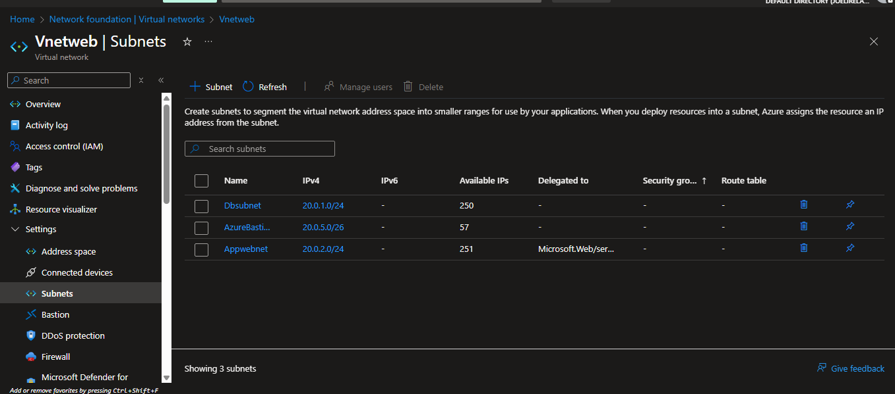
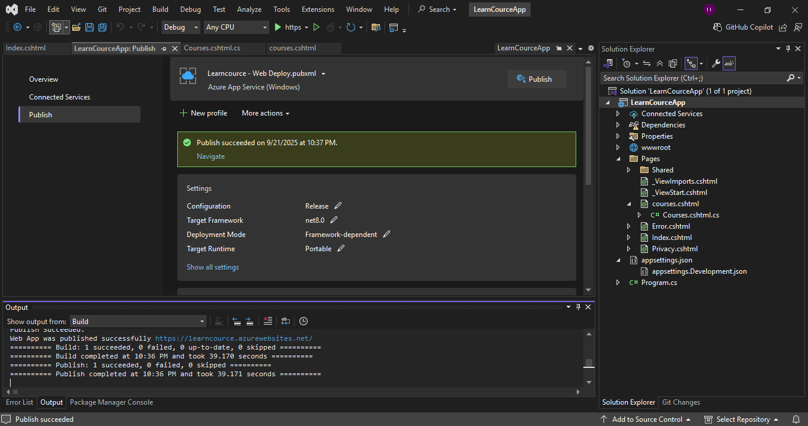

# 🚀 LearnCourceApp – Azure Web App with Private Database Integration  

This lab demonstrates deploying a **.NET 8 Razor Pages web application** to **Azure App Service** with private connectivity to a **MySQL database** hosted on an **Ubuntu VM** inside a VNet.  

It showcases how to:  
- Publish a modern web frontend using **Azure App Service**.  
- Securely connect to a **private database** using **VNet Integration**.  
- Control access with **NSGs** to prevent public database exposure.  
- Pull **live data** from MySQL into the frontend.  

---

## 🏗️ Lab Architecture  

  

**Key design points:**  
- **VNet**: `20.0.0.0/16`  
- **App Subnet** (Appwebnet): `20.0.2.0/24` → Delegated to `Microsoft.Web/serverFarms`  
- **DB Subnet** (Dbsubnet): `20.0.1.0/24` → Hosts Ubuntu VM with MySQL  
- **Bastion Subnet** (AzureBastionSubnet): `20.0.5.0/26` → For secure VM access  
- **NSG Rule**: Only allows port `3306` from `20.0.2.0/24` (App Service subnet) to DB VM  

---

## 📸 Screenshots  

### 🔹 Web Application  
  

### 🔹 Browsing from App  
  

### 🔹 Database VM (Ubuntu with MySQL)  
  

### 🔹 Network Security Group  
  

### 🔹 Virtual Network and Subnets  
  

### 🔹 Visual Studio – Publish  
  

---

## ✅ Final Test  

- Accessing the web app: [https://learncource.azurewebsites.net](https://learncource.azurewebsites.net)  
- Home page displays welcome banner and **Start Learning** button.  
- `/courses` page dynamically pulls records from **MySQL** in private subnet.  

---

## 📚 Key Learnings  

- How to deploy a **.NET web app** to Azure App Service.  
- How to configure **App Service VNet Integration**.  
- How to secure a database with **private subnets + NSG rules**.  
- How to connect a cloud app to a **MySQL database** in a private VM.  
