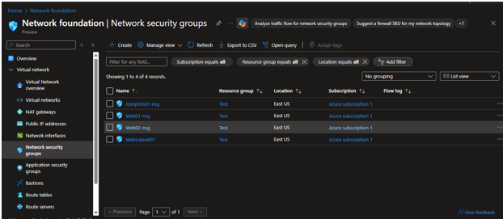
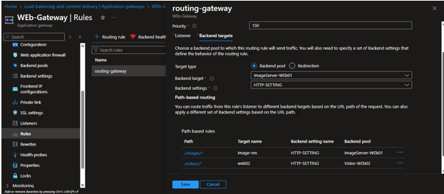
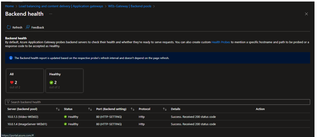
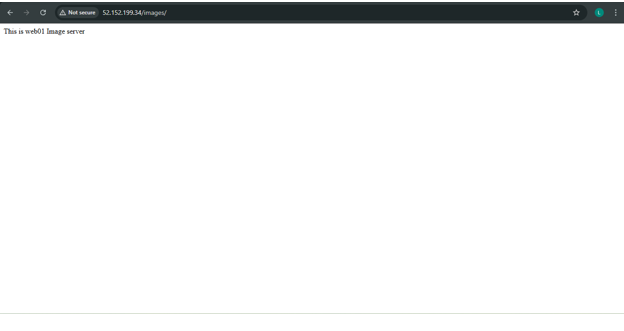

# Application Gateway Lab 🌐

This lab demonstrates deploying an *Azure Application Gateway* with two backend web servers (NGINX), a jumpbox VM, NSGs, and subnets.  
The Application Gateway is configured with *path-based routing* so that requests to /images/* go to **Web01**, and /videos/* go to *Web02*.

---

## Architecture Overview
- *Application Gateway*: Routes HTTP traffic from the internet to backend pools.  
- *Backend Pools*:  
  - Web01 → /images/*  
  - Web02 → /videos/*  
- *JumpVM*: Used for SSH/RDP management of the web servers.  
- *NSG Rules*: Allow SSH/RDP only from JumpVM; block direct public access to Web servers.  

---

## Resources Created
- *Resource Group*: Test  
- *VNet*: Vnet01 (10.0.0.0/16)  
  - Subnet01: WebSubnet (10.0.1.0/24) → Web01 & Web02  
  - Subnet02: Jump-VM (10.0.2.0/24) → JumpVM01  
  - Subnet03: AzureBastionSubnet (10.0.0.192/26) → Bastion  
- *NSGs*:  
  - Websubnet01 → Allows HTTP (80), Blocks SSH except from JumpVM  
- *VMs*:  
  - Web01 (Ubuntu + NGINX, Image server)  
  - Web02 (Ubuntu + NGINX, Video server)  
  - JumpVM01 (Windows VM for management)  
- *Application Gateway*: Configured with HTTP settings, backend pools, path-based rules.  

---

## Screenshots

### Resource Group

### Subnets

### Virtual Machines

### Web Subnet NSG

### NSG Rules

### Application Gateway Rules

### Backend Pool

### Browsing Results
  

### Proof

---

## Final Test
- Accessing *http://52.152.199.34/images/* → Served by *Web01* (Image server).  
- Accessing *http://52.152.199.34/videos/* → Served by *Web02* (Video server).  
- ✅ Both backend pools healthy and responding with HTTP 200 status.